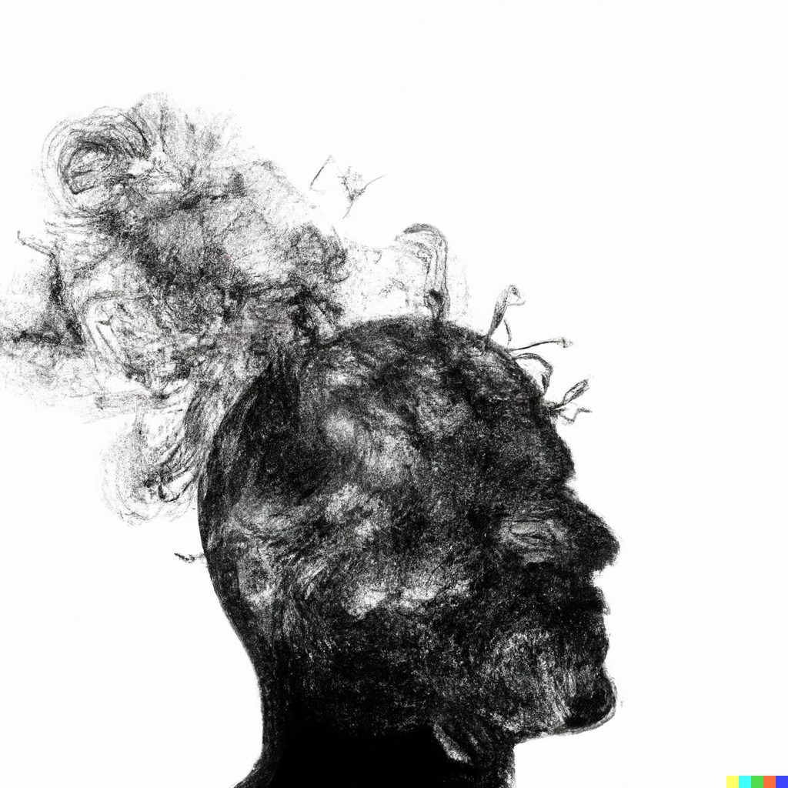

# Mental Exhaust

> DALL-E Prompt: smoke emitting from a thinker's head, white background, abstract

I think of thoughts as exhaust. You can capture your thoughts in the form of taking [notes](https://github.com/wepsree/substack/blob/main/coming-soon.md) so you can reuse them at a later time. Or you can just let your ideas go into the ether, but that may preclude them from compounding on one another.

In material science, there's a saying that there are no bad materials just poor applications. So even if you have a mundane idea, it may still be worth noting since it could be applied to seemingly unrelated fields.

Take for example air pollution. People are capturing smog to make [tiles](https://youtu.be/A1yCK6GS3Ew) and [bricks](https://qz.com/562319/a-chinese-artist-vacuumed-up-beijings-smog-for-100-days-and-made-a-brick-from-what-he-collected/). And they are capturing cow [farts](https://www.dailymail.co.uk/sciencetech/article-2606956/Now-THATS-wind-power-Cows-wear-BACKPACKS-capture-emissions-miniature-power-stations.html) to use as [biogas](https://en.wikipedia.org/wiki/Biogas). By itself, air pollution is a rather nebulous concept, but so far, it already has applications in home improvement and energy, so is it too farfetched to say air pollution will eventually have applications in... I don't know, esports? I'll keep an open mind to that.
