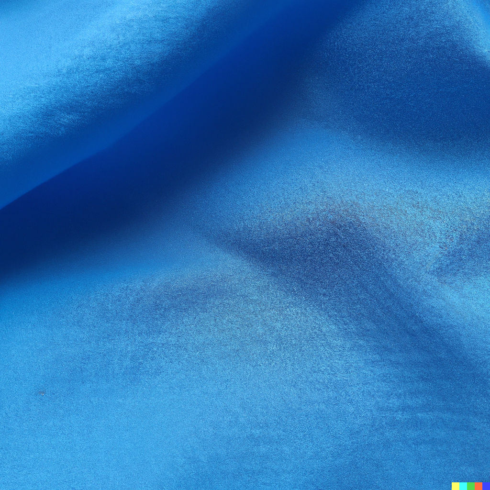

# Microplastics

> DALL-E Prompt: close up shot of a light blue polyester cloth

The other day I saw a perfectly good square cloth in the trash. It was originally used to wrap a puck of soap. I took it out of the trash and washed it and thought of all the uses it could be repurposed for instead of being buried in a landfill. I thought maybe it could be used for an air filter - maybe. I got curious and started doing some research on polyester and microplastics. This is what I found:

- Polyester fabrics release [microplastics](https://en.wikipedia.org/wiki/Microplastics) into the air
- We then [breathe in](https://www.theguardian.com/environment/2016/may/09/people-may-be-breathing-in-microplastics-health-expert-warns) those microplastics
- Microplastics [lodge in our bodies](https://www.theguardian.com/environment/2022/mar/24/microplastics-found-in-human-blood-for-first-time) which definitely isn't a good thing
- Washing polyester [pollutes our water](https://www.vox.com/the-goods/2018/9/19/17800654/clothes-plastic-pollution-polyester-washing-machine) with more microplastics

Maybe my square cloth should be buried in a landfill after all.

By the way, what is [gender reveal](https://twitter.com/libsoftiktok/status/1557123954791182336) powder made of?