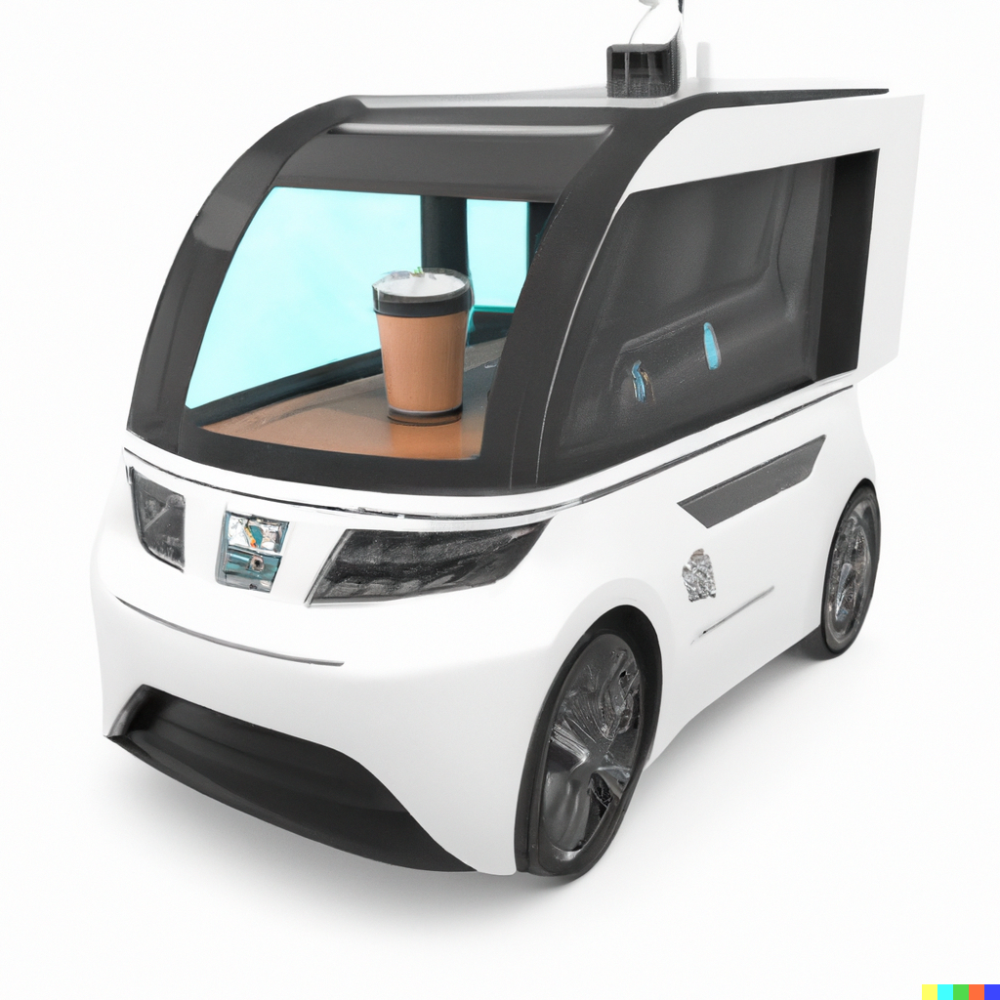

# Solving Autonomous Machines

> DALL-E Prompt: self-driving car in the shape of a coffee machine

Self-driving cars have been trending for a few years now and they sound like a great idea - so long as they work. Unfortunately there have been a handful of [fatal incidents](https://www.nytimes.com/2022/06/15/business/self-driving-car-nhtsa-crash-data.html#:~:text=In%20392%20incidents%20cataloged%20by,those%20Tesla%20crashes%20were%20fatal.) involving autonomous vehicles. The fatality involving [Uber and a jaywalking bicyclist](https://www.wired.com/story/uber-self-driving-car-fatal-crash/) is particularly disturbing because the victim did not sign up to be a part of the beta test.

How many other products of technology involved the involuntary loss of human life to develop? [Rocket ships](https://en.wikipedia.org/wiki/Space_Shuttle_Challenger_disaster), [nuclear](https://en.wikipedia.org/wiki/Demon_core) [power](https://en.wikipedia.org/wiki/Chernobyl_disaster), and the like don't count because the people who died on the job knew the risks when they signed up. The last time I can recall people involuntarily dying for the progress of technology was during the WWII [human](https://en.wikipedia.org/wiki/Unit_731) [experiments](https://en.wikipedia.org/wiki/Nazi_human_experimentation).

Switching gears, in artificial intelligence there's something called [The Coffee Test](https://geohot.github.io/blog/jekyll/update/2021/04/25/a-machine-ecology.html). It states: "A machine is required to enter an average American home and figure out how to make coffee: find the coffee machine, find the coffee, add water, find a mug, and brew the coffee by pushing the proper buttons." Thinking through the mechanics, the [feedback loop](https://en.wikipedia.org/wiki/Feedback) for driving a car is a lot simpler than the feedback loop for entering a home and making a cup of coffee.

A self-driving car only has to obey the laws of traffic which are far more concrete and less nuanced than the steps involved in passing the coffee test. So, driving a car should be well within the capabilities of a coffee-making robot. However that's assuming the concept of "if you can [dodge a wrench](https://www.youtube.com/watch?v=peUyLXrgYZ0) you can dodge a ball" applies to machine learning.
